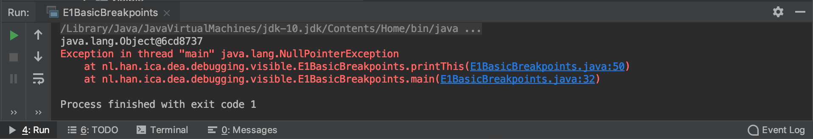
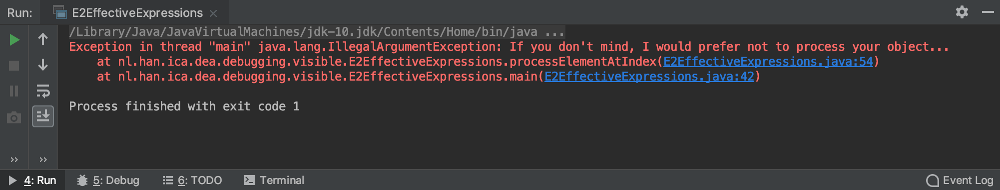
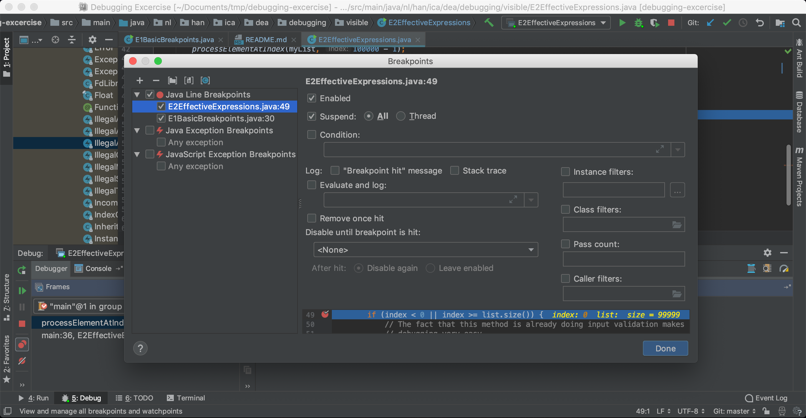
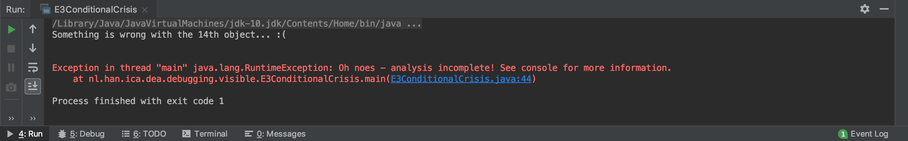

# Introduction
This exercise is part of the DEA course at the HAN University of Applied Sciences. 
Main subject is debugging and correctly interpreting a stacktrace.

## About this excercise
This excercise is based on the guide [ImageJ Debuggin Excerice](http://imagej.net/Debugging_Exercises), 
with its companion repository [ImageJ-Troubleshooting](https://github.com/imagej/imagej-troubleshooting).

Note that the source code is split into two packages:

 * `visible` - Source code for use and inspection in troubleshooting exercises. 
 These are the classes intended for inspection and setting breakpoints.
 * `hidden` - A simulated "black box" of utility methods. These classes are not 
 intended for inspection.
 
Troubleshooting is the art of determining the cause and/or location of a problem. 
If you have complete, perfect knowledge of the code then there isn't really a need 
for troubleshooting, as it is trivial to see why something is behaving incorrectly.

Because this project is intended to help new developers practice troubleshooting 
skills, it uses contrived examples, limited in complexity. Inspection of the 
`hidden` package will typically allow you to easily "troubleshoot" an exercise 
without using the intended technique.

Remember the goal of these exercises is not to solve the problems, but to learn 
how and when to use the myriad of troubleshooting techniques available. Given 
the inherent complexity that comes with a combined work, all of these techniques 
have their time and place when working on a rich any application.

## What not to do: print statements
For many developers, the first tool in their debugging toolbox is the print statement. 
Print statements are easy to lean on as a safety crutch: you don't need any special 
knowledge to use them, and they often work to answer common questions (e.g. "why is this 
variable null here?", "how many elements are in my array here?").

However, there are critical drawbacks to trying to debug via print statement:

* They are slow. If you realize you need to move or add a print statement, you need to recompile 
your code and re-launch your application.
* They are part of the code. Adding print statements changes line numbers, causes git to pick 
up modifications to the source code, and can even affect performance and/or behavior.
* They are limited. Even the most basic breakpoint and expression evaluation in your IDE debug 
mode gives you vastly more power and flexibility over print statements.
* Learning to use debugging tools is, understandably, a burden: it's "one more thing" to learn 
as a developer. But if you want to be a developer, you will almost certainly run into cases where 
debugging is necessary. So you may as well start familiarizing yourself with the tools now, 
gaining skills and perspectives that will serve you well throughout your career.

## Using this guide
The goal of these exercises is not to solve the problems, but to build up your toolbox of 
troubleshooting techniques and develop your intuition for when to apply each technique. Once 
you learn how to debug a Java application, you will have the knowledge to apply any of 
these techniques to any rich and complex application.

Because this project is intended to help new developers practice troubleshooting skills, 
you may find these examples contrived - indeed, they are. Exercises are kept simple and 
focused to allow practice of targeted techniques. If you have complete knowledge and 
understanding of the code there isn't really a need for troubleshooting: it is trivial 
to see why something is behaving incorrectly. Thus the source of these exercises is 
divided into `hidden` and `visible` packages. Users are strongly recommended to only 
inspect and set breakpoints from the visible classes. From a development point of 
view, consider the `hidden` package a 3rd-party library that you may not have 
control over, or access to the source code.

Changing the source code to actually fix the bugs is outside the scope of this guide, 
but motivated users are of course welcome to do so for practice.

If at any time you need to revert changes, you can always do so via the command:

```
git reset --hard origin/master
```

# Excercises

## Exercise 1: Stack Traces and Breakpoints

**Goals**

* Interpret a stack trace
* Practice setting breakpoints in IntelliJ/Eclipse
* Use the Variables window to inspect variable values
* Use the navigation commands to execute code in Debug mode

Breakpoints are a fundamental tool of debugging. They provide a way to instruct Java to stop code 
execution when a certain line of code is encountered, providing a chance to explore actively 
running code.

To get started in this exercise, open up the source file ``E1BasicBreakpoints``, and 
run it to get an idea of what's going on. We should see a simple stack trace:



Stack traces are a common starting point for debugging, as they are typically automatically 
produced when something goes wrong that the program was not prepared to handle. Java programs 
are executed in Last In, First Out order; that is, starting with the main method, as methods 
are called they are added to the top of the stack, the method at the top is what's currently 
running, and when a method completes it is removed from the stack, returning the program to 
the next method in line. When an exception occurs, a stack trace is printed, showing the 
order that methods have been queued, with the top of the stack being the location of the 
exception (and thus a likely place to start looking for problems!).

So looking back at the stack trace we got, we can see what went wrong (tried to use a null object) 
and where it happened (the line number at the top of the stack), but we don't know why the object 
was null at that point - which would be the actual root cause of the exception.

To investigate further, try to complete the following debugging steps:

1. Set a breakpoint in the main method, before ``makeAThing`` is called
2. Debug ``E1BasicBreakpoints.main()``.
3. When the breakpoint is encountered, step in to the ``makeAThing`` method
4. step over the line constructing a new Object
5. step out of the ``makeAThing`` method
6. In the Variables window, look at the value of the Object variable
7. 'resume' execution until the program completes

Now that you've walked through the program, do you know why we got a ``NullPointerException``?

**Takeaway**

* Stack traces are helpful in identifying starting points for debugging
* The Debug view allows line-by-line execution of code and inspection of variable values to help us 
pinpoint errors

## Exercise 2: Exceptions

**Goals**

* Set breakpoints on exception creation

Although breakpoints allow us a chance to peek inside running code, it is sometimes unclear where to start 
looking. Many times you'll find yourself replacing breakpoints until you find the correct spot to start 
debugging.

Start by opening the ``E2ExceptionCreation`` source and running it. Like the previous exercise, we have a 
stack trace to start from:



Try setting a breakpoint on the conditional line:

```
49 |    if (index < 0 || index >= list.size()) {
```

Try debugging now, using Resume any time a breakpoint is encountered. How many times do you hit a breakpoint?

Since we are only interested in the ``processElementAtIndex`` method when a problem actually occurs, 
let's try something different:

1. In the Debug window, select _View Breakpoint_. You should now see the following dialog



2. Now add a new ``Java Exception Breakpoint`` by selecting the ``+`` and selecting 
`IllegalArgumentException`
3. Debug the program. When it stops, inspect the Variables window.

At this point, we know there is a problem accessing the ``99999th`` element of the list, but 
the variables window doesn't tell us exactly what the problem is. We can manually expand 
and explore the list variable - but given its size that could be cumbersome.

Can you tell what went wrong in the program?

**Takeaways**

* Setting breakpoints on exceptions avoids unnecessary breakpoint hits (and can be useful when we 
aren't sure where to set the breakpoint)

## Exercise 3: Conditional breakpoints

**Goals**

* Create a breakpoint that triggers after a specified number of hits
* Create a breakpoint that triggers when a certain condition is ``true``

Breakpoints trigger every time the corresponding line would be executed, which may be 
undesirable for repeated code blocks. It may be enough to carefully consider the breakpoint 
placement - on an exception, or within a conditional block. But when these options are not 
available, we can make our breakpoints more powerful by triggering only when there's 
something of interest to see.

Start by opening the ``E3ConditionalCrisis`` source and running it. This time our console 
output looks a bit different:



In addition to the exception stack trace, the program itself appears to have found an 
invalid object, causing the processing to go unfinished. Although we could set a 
breakpoint on the exception, as we did in exercise 2, the exception is actually 
happening after the more interesting part of the program - the loop. As we learned 
in exercise 2, breakpoints in code that is called repeatedly are annoying, so let's 
see what we can find by attaching conditions to our breakpoint.

First set a breakpoint on the line after the ``everythingIsOK`` assignment:

```
39 |    everythingIsOK = ObjectAnalyzer.processElementAtIndex(myArray, i);
40 |    i++;
```

Then try the following:

1. Open the _Breakpoints_ dialog
2. Select the breakpoint from above.
3. Check the _Pass count_ checkbox and set it to the object number printed in the error message.
4. Try debugging

Was there a problem with the current object when/if your breakpoint is hit?

Using count-based conditional breakpoints can be very useful if the error is deterministic. 
In this case it will not work, so we need to try something different. 

We know the ``everythingIsOK`` flag reflects the integrity of the object at a given index 
- so what we really want to use here is a breakpoint that stops in the loop when the 
``everythingIsOK`` flag is set to ``false``. Fortunately, breakpoints have an optional 
_Condition_ flag - where we can enter any Java statement that resolves to a boolean value. 
Try it out:

1. Open the _Breakpoints_ dialog again
2. Uncheck the _Pass count_ checkbox
3. Check the _Condition_ box
5. Enter the condition we want to check
6. Try debugging again

Were you able to get the breakpoint to stop in the loop only when a problem is encountered?

What was suspicious about the object at that index?

**Takeaways**

* Setting a pass count on a breakpoint is useful if problematic code is called multiple times.
* If problems appear randomly, using a conditional expressions on the breakpoint can help.
